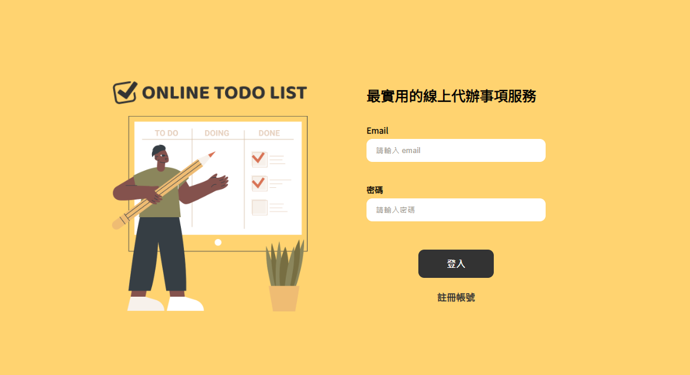

# React + Vite

This template provides a minimal setup to get React working in Vite with HMR and some ESLint rules.

Currently, two official plugins are available:

- [@vitejs/plugin-react](https://github.com/vitejs/vite-plugin-react/blob/main/packages/plugin-react/README.md) uses [Babel](https://babeljs.io/) for Fast Refresh
- [@vitejs/plugin-react-swc](https://github.com/vitejs/vite-plugin-react-swc) uses [SWC](https://swc.rs/) for Fast Refresh

# Preview | 👀 [DEMO](https://jesswu1551.github.io/react_todo/)

React Todo 練習
功能包含:
1. 註冊&登入
2. 登入後可進行 todo 新增/編輯/刪除

> (由六角學院提供API，並於每日Reset)

